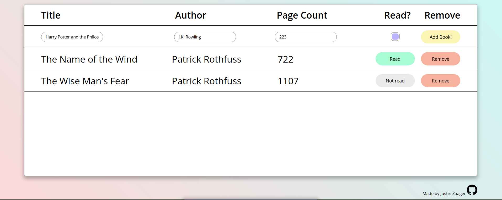

# The Odin Project - Full Stack JavaScript 

## Project: Library

A single page web application to store all books on your "to-read" list. No storage has been implemented (for now), so **all data will be lost upon refresh.**

[Live Version](https://jzaager.github.io/library/)



The main focus of this project was to get a better understanding of more advanced JavaScript concepts.

### Constructors construct

The first new concept encountered in this project was the constructor. Constructors are used to create and initialize new objects that will have similar properties and methods.

**Syntax:**

```javascript
// Creation of a constructor
function Constructor(arg1, arg2) {
  this.property1 = arg1
  this.property2 = arg2
  this.doSomething = function() {
    // do something
  }
}
// Instantiation of object ***don't forget the 'new' keyword***
const variable = new Constructor(arg1, arg2)
```

More on 'this' below.

### Prototypes 

Prototypes are objects that the original object inherits from. The original object has access to all of its prototype's methods and properties.

**Syntax:**

```javascript
Constructor.prototype.doSomething = function() {
  // do something
}
```
This is similar to line 23 above in that both functions are defined as methods and can be called with:

```javascript
variable.doSomething()
```
However, defining the method on the constructor itself will create a new copy of the function for each object that it instantiates. In contrast, using the **prototype** to define the method allows each instantiated object to access the same function without creates copies of it. This is increasingly important as the project grows in size.

Prototypes can also be copied to be used as prototypes of other constructors, but it is important to use ```Object.create()``` to create said **copy**, and not overwrite the original prototype.

**Syntax:**

```javascript
Constructor2.prototype = Object.create(Constructor.prototype)

Constructor2.doSomething()
// does the thing
```

### 'this' is Where the Fun Begins

'this' refers to the context of a function invocation. The 4 types of function invocation in JavaScript are: (1) function invocation; (2) method invocation; (3) constructor invocation; and (4) indirect invocation.

An excellent resource to help understand 'this' in different contexts can be found [here](https://dmitripavlutin.com/gentle-explanation-of-this-in-javascript/#6-bound-function).

### Binding Functions to Tie 'this' Together

Due to the ever-changing value of 'this', the article above discusses the ```.bind()``` method (as well as others) that can be used to create functions with a predefined value of 'this'. I found this method incredibly useful and wanted to highlight the syntax, below, as a reminder:

**Syntax:**

```javascript
const myObject = {property1: 'value1'};

function myFunction() {
  console.log(`this: ${this}`);
}

const boundFunction = myFunction.bind(myObject);
boundFunction(); 
// 'this: [object Object]" ('[object Object]' is the reference to myObject)
```